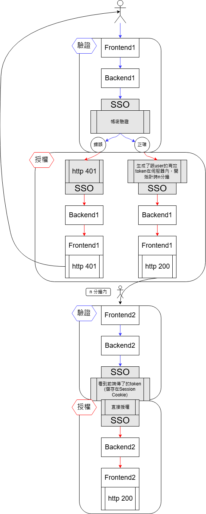
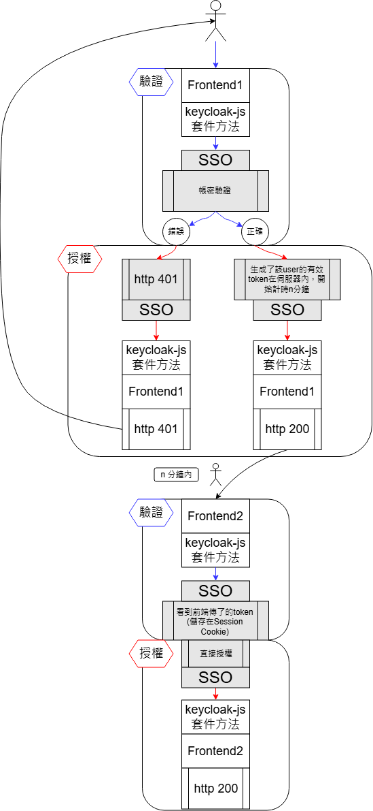

[TOC]

## 簡介
本專案提供 SSO 客戶端 (SSO Client) 串接示範，幫助開發者快速了解如何將應用程式與 單一登入 (Single Sign-On, SSO) 系統整合。透過本範例，您將學習如何在前端或前後端環境下，使用標準 OAuth 2.0 或 OpenID Connect (OIDC) 流程完成身份驗證與授權。

開始專案前你應該先與SSO負責人員做需求訪談。

## 串接SSO流程
1. 準備與SSO負責人訪談所需的資料(見1.)
2. 需求訪談
3. 填寫需求單`S207-01-系統操作暨變更申請單`
4. 需求訪談並取得必要資訊(見2.)
5. 開始串接SSO，詳見DEMO說明(見3.)
6. 按照DEMO設定完程進行測試，如有錯誤請SSO管理員幫你看log

## 1. 需求訪談前你應該要準備的資訊
- IP	
- 應用系統名稱
- 應用系統英文簡稱
- 需求摘要
- REALM (共同討論決定)
- CLIENTID (共同討論決定)
- validRedirectUri (共同討論決定)

validRedirectUri需要符合`http://<host>/<prefix>/*`，如果您host上有多系統，一定要用prefix分流，如果直接開放`<host>/*`，生怕會有住在host上的不明程式可以被sso連。

## 2. 需求訪談後你會取得的資訊
- REALM
- CLIENTID
- SSO_URL
- SECRET (Confidential Client適用)

需求訪談後如確定執行，請填寫 `S207-01-系統操作暨變更申請單`

填寫申請單完成後，SSO負責人會在SSO幫你設定所有必備資訊(見1.)這些設定值要放在你的程式中。接下來對開發者而言，有分為串接面及實作面。

### 2.1. 串接面
Confidential/Public都是從前端取去呼叫一個能與SSO互動的套件，去進行`登入`/`登出`/`檢查`請求，這些請求都是對keycloak特定的url執行，無論在什麼架構實作這些請求都是一樣的，因此串接只需要確保有成功的將使用者請求轉對keycloak請求。

Confidential是將keycloak互動套件透過POM導入，再透過controller實作端點，public是將keycloak互動套件透過npm導入，直接調用專屬方法去請求SSO。

所以開發者只需要拿這demo程式去修改Confidential的controller或public的請求方法即可。

更棒的是，需要改的東西只有
- realm
- clientId
- ssoUrl
- frontendUrl
- backendUrl(適用Confidential)
- secret(適用Confidential)

共6個變數，所以只要去環境變數設定就好。

### 2.2. 實作面
SSO能確保你可以使用其登入驗證功能，但要保護你的訪問權，要自己在程式中設定權限，通常建議前端專案搭配router使用，後端專案搭配spring security使用，可以針對特定url去卡關驗證機制，用`檢查`過濾，沒通過就轉導到`登入`。

總共只有3個function：`登入`/`登出`/`檢查`，可自由發揮如何鑲入程式。

* 你不需要自行實作任何`登入`/`登出`/`檢查`邏輯，只需要呼叫這三個function。

## 3. 這個專案能做什麼？
模擬 SSO 串接流程：提供 Confidential Client (需要後端) 與 Public Client (僅前端) 兩種應用場景。
示範 OAuth 2.0 / OIDC 認證流程：包括 登入 (Login)、登出 (Logout) 以及 Token 交換 等操作。
協助開發者快速整合 SSO：透過可運行的 Demo，讓開發者能夠輕鬆上手。

### 3.1. 適用對象
- 前端開發者：需要在瀏覽器端與 SSO 服務進行互動的應用程式開發者。
- 後端開發者：負責處理安全授權邏輯、管理 Token 交換的開發者。
- 完整應用開發者：同時開發前後端應用的開發者，需完整掌握 SSO 串接流程。

### 3.2 架構
SSO 登入的最大好處是可以根據功能區分成受保護區域/未受保護區域，受保護區域需要登入才能訪問。以下展示從使用者角度出發，登入SSO後，可以無輸入帳密直接登入每個有串接同REALM的系統，使用者登入後，對多個系統的的登入有效時間都由同REALM管理，失效前不用重複登入。

#### Confidential Client 前後端

#### Public Client 前端

如果Confidential/Public Client都有在SSO介面勾選Standard Flow(Authorization Code Flow)，且為同REALM，那也是可以互相登入的。

### 3.3. 如何選擇適合的範例？
請根據您的開發需求選擇對應的資料夾：
- 前後端皆有 (Full-stack) → confidential 資料夾 (Confidential Client)
- 僅有前端 (Frontend-only) → public 資料夾 (Public Client)

進入對應資料夾後，再按照內部文件建置範例專案完成 SSO 串接！

## 4. 延伸：什麼是OAuth 2.0 及 OpenID Connect (OIDC)？
OAuth 2.0 和 OpenID Connect (OIDC) 是現代網路應用程式中 身份驗證 (Authentication) 與 授權 (Authorization) 的標準協議

* OAuth 2.0 負責授權 (讓應用程式能安全地存取 API)。
* OIDC 負責身份驗證 (確認使用者的身份，並提供基本資料)。

### OAuth 2.0：授權標準
OAuth 2.0 是一種開放標準的 授權 (Authorization) 協議，允許應用程式在 不直接存取使用者帳號密碼 的情況下，透過 存取權杖 (Access Token) 來存取受保護的 API 或資源。OAuth 2.0 只負責授權 (Authorization)，但它 不包含使用者身份驗證 (Authentication)，這就是 OIDC 存在的意義。

### OAuth 2.0 流程：
1. 使用者透過應用程式進行 登入授權，授權應用程式存取他們的資源。
2. 授權伺服器發送一個 Access Token 給應用程式。
3. 應用程式使用這個 Access Token 存取資源伺服器上的受保護資源。

### OpenID Connect (OIDC)：身份驗證標準
OpenID Connect (OIDC) 是建立在 OAuth 2.0 之上的 身份驗證 (Authentication) 協議，用來確認使用者的身份，並提供其基本資料 (如名稱、Email)。

🔹 OIDC 主要增加的功能：
- ID Token：一種特殊的 JWT (JSON Web Token)，包含使用者的身份資訊
- UserInfo 端點：允許應用程式獲取使用者的額外資訊。

🔹 OIDC 典型流程：

1. 使用者登入，OIDC 驗證身份並發送 ID Token 和 Access Token。
2. 應用程式解讀 ID Token，確認使用者身份。
3. 若需要存取 API，則使用 Access Token (與 OAuth 2.0 流程相同)。