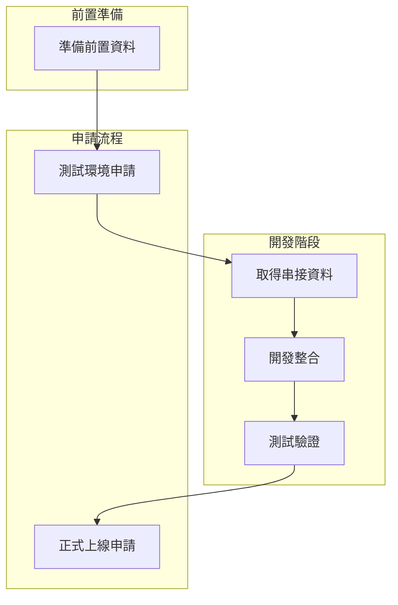
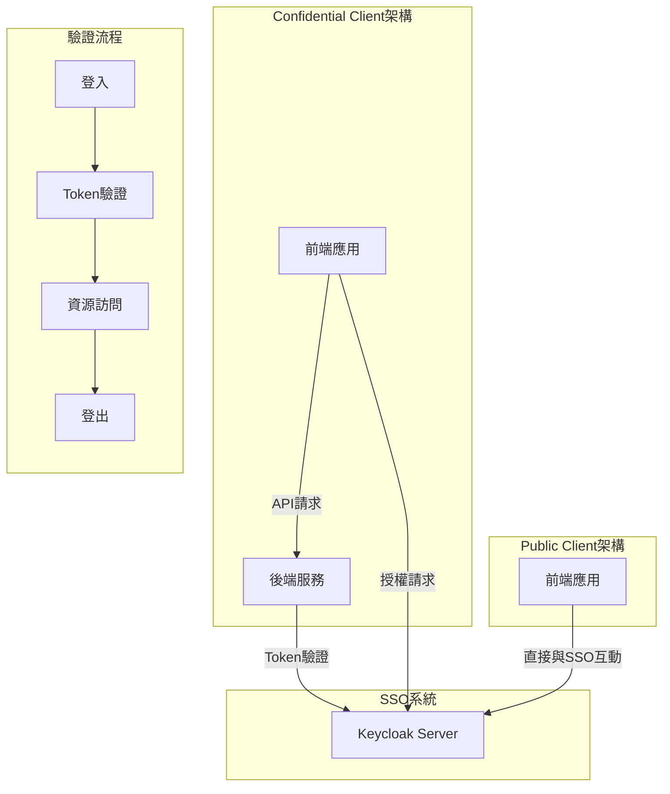
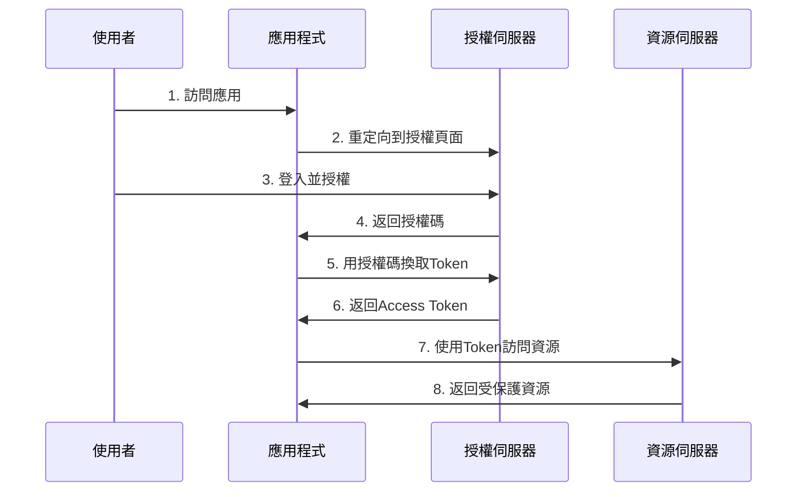

[TOC]

## 系統架構圖

### 行政流程架構

### 技術架構圖

### OAuth 2.0/OIDC流程圖

---

單一登入系統 (Single Sign-On, SSO) 分別提供兩種驗證方式:
1. **一般使用者**驗證
2. **管理員**驗證

# TL;DR

- [系統流程](#申請『單一登入系統』的流程)
- 程式 Demo:
  - [只有前端的專案(本篇使用 React.js)](./public/README.md)
  - [擁有後端的專案(本篇使用 Java+SpringBoot)](./public/README.md)

## 單一登入系統串接說明指南

本文件將說明以下資訊:
1. 申請單一登入系統的流程
2. SSO系統串接技術示範
   - 純前端架構應用串接方式
   - 前端+後端架構應用串接方式   
    我們通過實作展示以上兩種常見架構，如何正確地將應用系統與單一登入(SSO)客戶端進行整合，幫助開發人員快速掌握應用程式與SSO系統的對接方法。這兩種架構都將使用標準的`OAuth 2.0`或`OpenID Connect(OIDC)`協議來完成身份驗證與授權流程。

---

## 申請『單一登入系統』的流程

在開始進行專案串接SSO前，請『應用系統專案負責人』務必先與 SSO 負責人進行討論。

> 📌 串接 SSO 流程
1. **準備前置資料**-整理所需資訊
2. **測試環境申請** - 提交申請
3. **取得串接資料**-取得應用系統串接 SSO 必要資料
4. **開發整合**-依照 DEMO 說明進行程式開發串接(見3.)
5. **測試驗證**-按照 DEMO 設定進行測試，如遇錯誤請聯繫 SSO 管理員並提供明確的日誌資訊供除錯。
6. **正式上線申請**-提交申請

### 串接所需資訊

| 項目  | 說明  | 
| ---  | ---- |
| SSO_URL | 用於串接程式中，sso url |
| REALM |  用於串接程式中，realm setting |
| CLIENTID | 用於串接程式中，client setting  |
| SECRET | Confidential Client適用 |

這些設定值將會使用於串接 sso 的程式中。

---

以上為串接 SSO 的初始流程，接下來將進入技術實作部分。

---

## 開發一個串接單一登入系統的應用程式

### 1. 概述

✏️ 本文件分為兩個主要部分：**串接概念**與**程式實作**。在開始前，請確保您已理解 `OAuth 2.0` 及 `OpenID Connect (OIDC)` 的基本概念。若不熟悉，可先閱讀本文件最後的[延伸資料：OAuth 2.0 與 OpenID Connect](#4-延伸什麼是-oauth-20-及-openid-connect-oidc)。

### 2. 專案說明

#### 2.0 開發環境

如果要在本地啟動 keycloak 模擬環境，請使用對應的 Keycloak Version : 

- 外部驗證: `26.1.3`
- 內部驗證: `18.0.18`

#### 2.1 功能說明

本專案旨在：
- **提供兩組 demo 程式，模擬 SSO 串接流程**：提供 Confidential Client (需要後端) 與 Public Client (僅前端) 兩種應用場景
- 示範 `OAuth 2.0`/`OIDC` 認證流程：包括**登入**、**登出**以及 **Token 交換**等操作
- 協助開發者快速整合 SSO：透過可運行的 Demo，讓開發者能夠輕鬆上手

#### 2.2 適用對象
- 前端開發者：需要在瀏覽器端與 SSO 服務進行互動的應用程式開發者
- 後端開發者：負責處理安全授權邏輯、管理 Token 交換的開發者
- 完整應用開發者：同時開發前後端應用的開發者，需完整掌握 SSO 串接流程

#### 2.3 架構說明

SSO 登入的主要好處是讓應用能區分**需要登入的區域**和**不需要登入的區域**。下圖展示使用者體驗：用戶只需登入一次，就能訪問所有接入同一個 REALM 的系統，不必重複輸入帳密。所有系統的登入狀態由 SSO 統一管理，在登入有效期內都能直接訪問。

  

    <h4>Confidential Client 前後端</h4>
    
  

  

    <h4>Public Client 前端</h4>
    
  

> 說明: 假設您在同一個 REALM 下同時部署了 **Confidential** 和 **Public Client** 應用，並且都在 SSO 設定中開啟了 **Standard Flow(Authorization Code Flow)**，則使用者在登入其中一個應用後，可以不需再次輸入密碼驗證，即可直接訪問另一個應用。

### 3. SSO 串接概念

Confidential 與 Public Client 都是從前端發起呼叫一個能與SSO互動的套件，進行`登入`/`登出`/`檢查 token 是否有效與刷新`請求。

這些請求都是對 keycloak 特定的 URL 執行，無論在什麼架構實作這些請求都是一樣的。串接時只需確保成功將使用者請求轉為對 keycloak 的請求即可。

- **Confidential Client**：將keycloak互動套件透過POM導入，再透過controller實作端點
- **Public Clien**t：將keycloak互動套件透過npm導入，直接調用專屬方法去請求SSO

開發者只需修改Demo程式中的 Confidential controller 或 public 請求方法，且僅需更改以下配置參數：
- realm
- clientId
- ssoUrl
- frontendUrl
- backendUrl (適用Confidential)
- secret (適用Confidential)

📌 這些參數建議透過環境變數設定。

### 4. 實作指引

#### 4.1 如何選擇適合的範例

請根據您的開發需求選擇對應的資料夾：
- **前後端皆有 (Full-stack)** → [confidential 資料夾 (Confidential Client)](./confidential/README.md)
- **僅有前端 (Frontend-only)** → [public 資料夾 (Public Client)](./public/README.md)

進入對應資料夾後，按照內部文件建置範例專案完成 SSO 串接。

#### 4.2 權限控制實作

目前公司內 SSO 能確保您可以使用其登入驗證功能，但對於應用要保護您自己的訪問權限，例如需要在程式中自行設定權限控制：
- 前端專案建議搭配router使用
- 後端專案建議搭配spring security使用

可以針對特定URL設置驗證機制，用`檢查`函數過濾，未通過驗證則轉導到`登入`。

總共只有3個核心功能：`登入`/`登出`/`檢查`，可自由發揮如何整合進您的程式。

**注意**：您不需要自行實作任何`登入`/`登出`/`檢查`邏輯，只需呼叫Demo中提供的函數即可。

---

## 延伸：什麼是 OAuth 2.0 及 OpenID Connect (OIDC)？
`OAuth 2.0` 和 `OpenID Connect (OIDC)` 是現代網路應用程式中 **身份驗證 (Authentication)** 與 **授權 (Authorization)** 的標準協議。

* OAuth 2.0 負責授權 (讓應用程式能安全地存取 API)。
* OIDC 負責身份驗證 (確認使用者的身份，並提供基本資料)。

### OAuth 2.0/OIDC流程圖

### OAuth 2.0：授權標準

`OAuth 2.0` 是一種開放標準的 **授權 (Authorization)** 協議，它允許應用程式在 不直接存取使用者帳號密碼 的情況下，透過 `存取權杖 (Access Token)` 來存取受保護的 API 或資源。OAuth 2.0 只負責**授權 (Authorization)**，但它 不包含使用者**身份驗證 (Authentication)**，這就是 OIDC 存在的意義。

### OAuth 2.0 流程：
1. 使用者透過應用程式進行**登入授權**，授權應用程式存取他們的資源。
2. 授權伺服器發送一個 Access Token 給應用程式。
3. 應用程式使用這個 Access Token 存取資源伺服器上的受保護資源。

### OpenID Connect (OIDC)：身份驗證標準
`OpenID Connect (OIDC)` 是建立在 `OAuth 2.0` 之上的 **身份驗證 (Authentication)** 協議，用來確認使用者的身份，並提供其基本資料 (如名稱、Email)。

🔹 OIDC 主要增加的功能：
- **ID Token**：一種特殊的 JWT (JSON Web Token)，包含使用者的身份資訊
- **UserInfo** 端點：允許應用程式獲取使用者的額外資訊。

🔹 OIDC 典型流程：

1. 使用者登入，OIDC 驗證身份並發送 `ID Token` 和 `Access Token`。
2. 應用程式解讀 ID Token，確認使用者身份。
3. 若需要存取 API，則使用 `Access Token `(與 OAuth 2.0 流程相同)。