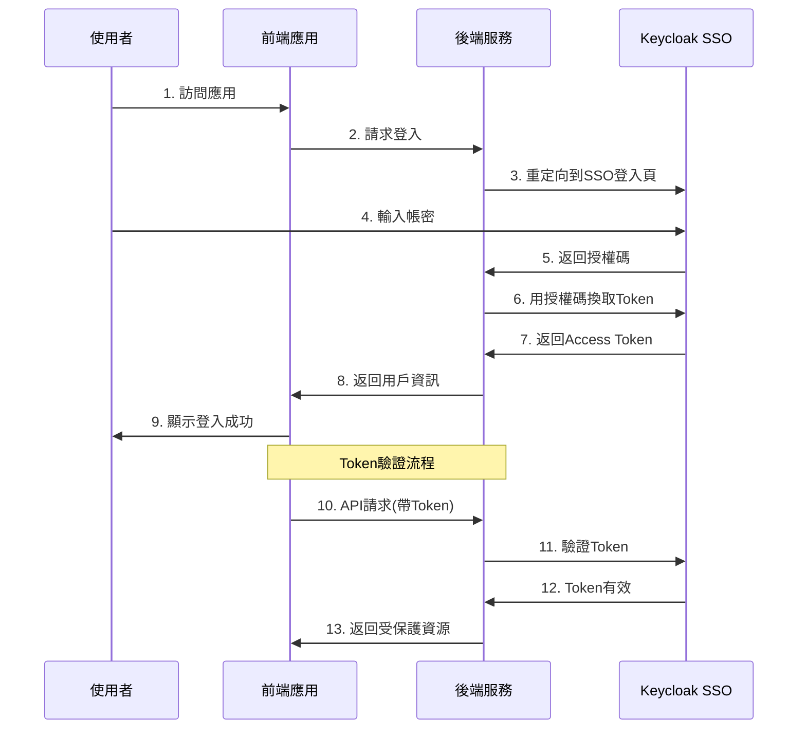

## 1. 使用建議

> 相關方法與 API 說明都置於程式碼註解中。

### 認證流程圖

### 適用專案  
- 準備好前後端專案。(Full-stack)

## 2. 開始
1. 依照 [confidential-backend](./confidential-backend/README.md) 指示，啟動專案以查看 DEMO 成果，或參考程式完成自己的**後端串接**

2. 依照 [confidential-frontend](./confidential-frontend/README.md) 指示，啟動專案以查看 DEMO 成果，或參考程式完成自己的**前端串接**
