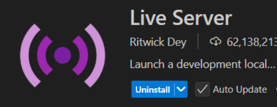

# 0. (可選)測試前置作業
- Runtime需求：
    - VSCode
- 專案需求：是原生前端頁面，無任何需求
- 專案啟動：
    1. 請使用VS Code Live Server啟動
    
    2. 點開`login.html`，按右下角啟動
    
    - 登入頁面：`http://127.0.0.1:5500/confidential/confidential-frontend/login.html`

# 1. 你會用到的檔案與修改說明
在confidential client，前端不是負責與keycloak交互者，所以你要用什麼前端都沒影響，只要能請求後端就行了。
**必要檔案**：
- `confidential-frontend/config.js`：先把值都填好，按照需求訪談的結果填寫，按造你的專案支援度可改成`.env`
- `confidential-frontend/login.html`、`confidential-frontend/login.js`、`confidential-frontend/login.css`：
    1. login.js`裡面有3個打後端端點的function，已標記必要，與後端對應好了，url不要改。
    2. 其他看需求可微調，例如每幾秒請求一次，可自己寫迴圈請求這三個必要function，因為每個網站需求不同，沒辦法寫客製化，僅提供登入、登出以及驗證的判斷方式，核心的請求url只要有以下任一套件即可AJAX、jQuery，請前端工程師自行判斷需要判斷登入/登出的時機，這個串接只會有3種行為(`登入`、`登出`、`驗證`)，前端打後端url，後端打SSO的url，SSO打後端url，url無誤就不可能有程式面導致的驗證失敗狀況，客製化請參考程式註解
    3. hHTML 與 CSS 僅用於確保 DEMO 畫面正常顯示

**DEMO測試完成後**，將`login.js`的必要function嵌入至您的前端程式需要驗證登入的地方。

# 2. 使用*login.js的判斷式*達到全頁面控制權限
## 2.1 決定哪些頁面需要登入驗證

**若某些頁面需登入後才能訪問**，對該頁面卡關設計，將*login.js的判斷式*設為filter，或者在路由守衛放置這個邏輯。


```js
if (accessToken) {
    verifyToken(accessToken).then(isValid => {
        if (isValid) {
            document.getElementById('loginButton').style.display = 'none';
            document.getElementById('userInfo').style.display = 'block';
            document.getElementById('username').textContent = `用戶名: ${usernameParam || '未知'}`;
            document.getElementById('email').textContent = `郵箱: ${emailParam || '未知'}`;
            document.getElementById('statusText').textContent = "使用者已登入";
        } else {
            document.getElementById('statusText').textContent = "登入會話已失效，請重新登入";
            window.history.replaceState({}, document.title, window.location.pathname);
        }
    });

    // *非必要* 每 10 秒呼叫一次 verifyToken 來檢查登入狀態
    setInterval(function () {
        verifyToken(accessToken).then(isValid => {
            if (!isValid) {
                document.getElementById('statusText').textContent = "登入會話已失效，請重新登入";
                document.getElementById('userInfo').style.display = 'none';
                document.getElementById('loginButton').style.display = 'inline-block';
                // 清除 URL 中的 token 參數（避免再次自動讀取到已失效的 token）
                window.history.replaceState({}, document.title, window.location.pathname);
                // 提示使用者重新登入
                alert("您的登入已過期，請重新登入！");
            }
        });
    }, 10000);
}
```

為什麼不檢查Session Cookie(Keycloak SSO存放token的地方)就好？前端 JavaScript 無法訪問 session cookie，因為設定了 HttpOnly 屬性 ，讓 JS 不能存取該 cookie。

DevTools > Application > Cookies
```
Name:        JSESSIONID
Value:       abcdef123456
HttpOnly:    ✅
Secure:      ✅
``````
```js
console.log(document.cookie); // 印不出來這個 cookie
```